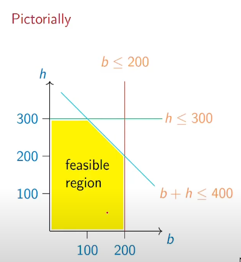

# Linear Programming

constraints and objective to be optimized are linear functions
* constraints: a1x1 + a2x2 + ... + amxm <= K, b1x1 + b2x2 + ... + bmxm >= L
* Objective: c1x1 + c2x2 + ... + cmxm

### Example:
let us take a sweet shop that sells burfis and halwa 
* profit for box of burfis is 100
* profit for box of halwa is 600
* daily demand for burfis is atmost 200
* daily demand for halwa is atmost 300
* no of boxes produced is 400 a day 

now what is the most profitable mix of burfis and halwa

* let b be the no of boxes of burfis
* let h be the no of boxes of halwa

### Objective:
* Maximize profit

### Constraints:
* b <= 200
* h <= 300
* b + h <= 400
* b >= 0
* h >= 0

