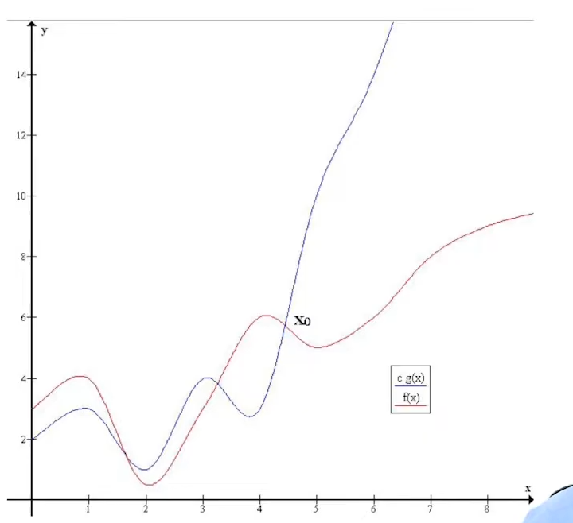

# ----- ORDERS OF MAGNITUDE -----

## Upper bound

- f(x) is said to be O(g(x) if we can find c and x0 such that c.g(x) is an upper bound of f(x) for x beyond x0.
- f(x) <= c.g(x) for every x greater than x0.

## graphs of typical functions we have seen

for example:
* let 100(n) + 5 and n2
    * 100n + 5 <= 100n + n = 101n for n >= 5
    * 101n <= 1012
    * 101n <=  101n2
    * let n0 = 5, c = 101
    * then 100n + 5 is O(n)

* the choice of n0 and c is not unique
    * for the same example
    * 100n +  5 <= 100n + 5n = 105n for n >= 1
    * 105n <= 105n2
    * here n0 = 1, c = 105
* 100n2 +20n + 5 is O(n)
	* 100n2 + 20n + 5 <= 100n2 + 20n2 + 5n2 for n >= 1
	* 100n2 + 20n + 5 <= 125n2 fot n >= 1
	* n0 = 1, c = 125
* but n3 is not O(n2)
	* for any c, cn2 <= n3 for n >= c
	* no matter how big the c is

***
## Useful properties

* if f1(n) is O(g1(n)) and f2(n) is O(g2(n)) then  
* f1(n) + f2(n) is O(max(g1(n), g2n)

***

## Lower bounds

* lower bound is kinda the opposite of the upper bound
* n2 is lower bound of n3
* n2 < n3  for all c = 1, n > 1

## Tight bounds

* f(x) is said to be tightly bounded by g(x) if g(x) is both the upper and lower bound of f(x)
* n(n - 1) is tightly bounded by n2 
	* n(n - 1)  = n2 / 2 - n / 2 <=  n2 / 2 for all  n > 0 (Upper bound)
	* n(n - 1)  = n2 / 2 - n / 2 >=  n2 / 2 - (n / 2 * n / 2) for all  n > 2 (Lower bound)

