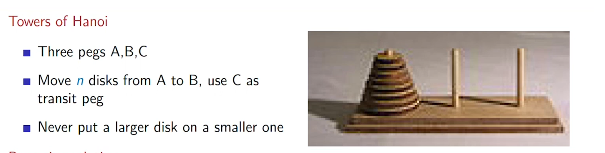

# ----- RECURRENCE -----
***

no of moves taken to do this is
M(n)

* M(1) = 1
* M(n) =  M(n-1) + 1 + M(n - 1) = 2M(n - 1) + 1 
* here first M(n-1) is moving the disks from a to c and 1 is for moving the last one to b then second M(n-1) for moving all the other disks from c to b.
* now put M(n) in M(n - 1)
* M(n) = 2(2M(n-2) + 1)+1 = 22M(n-2)+(2 + 1)
* M(n) = 22(2M(n-3) + 1)+(2 + 1) = 23M(n-3)+(4 + 2 + 1)
the last term (4+2+1) is (22 + 21 + 20) or (23-1) so
* M(n) = 23M(n-3)+(23-1) if expanded 3 times
* if expanded k times:
	* M(n) = 2kM(n-k)+(2k-1)
	If expanded n-1 times:
	* M(n) = 2n-1M(n-(n-1))+(2n-1-1)
	* M(n) = 2n-1M(1)+(2n-1-1)
	* M(n) = 2n-1+ 2n-1-1
	* M(n) = 2n-1