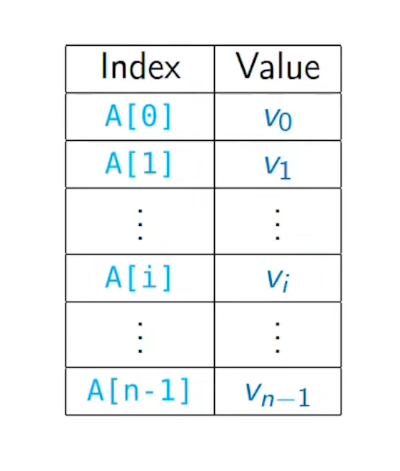

***
## Arrays
* fixed size
* allocate a contiguous part of memory
    * n times the storage is allocated for a single value 

* supports random access
    * unlike lists accessing A[i] takes constant time independent of i
    * but inserting and deleting elements are expensive
    * if we want to delete an element A[i] then all the elements after them have to be moved up in the array
    * if we want to add an element A[i2] after A[i] then all the elements after it have to moved down in the array
    * the worst case takes time of O(n)
* for exchange also the time is constant
