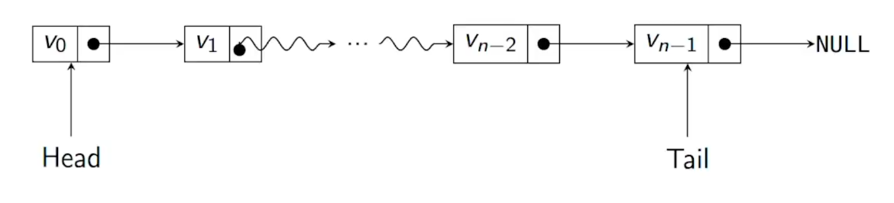
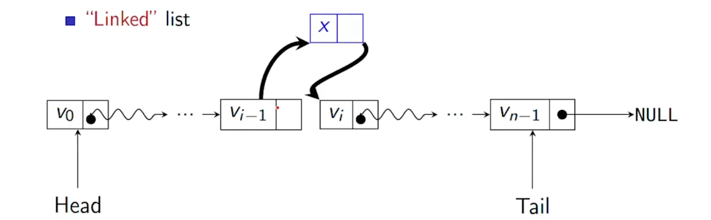
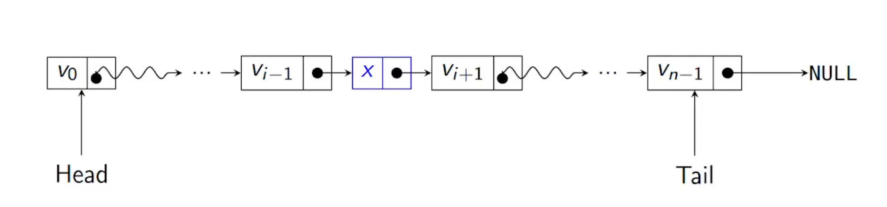
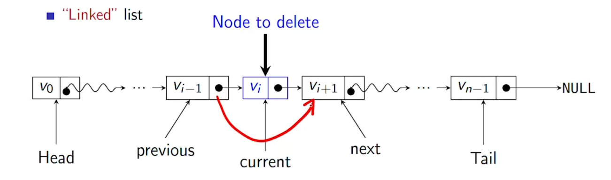
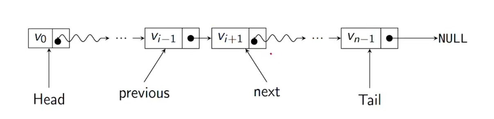
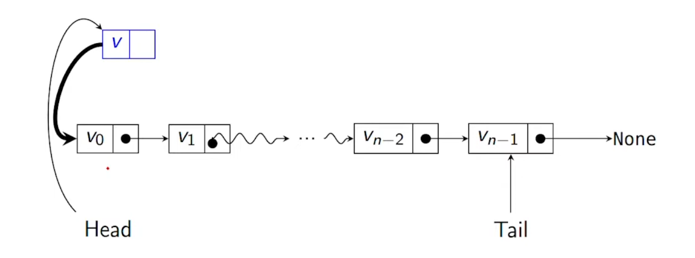
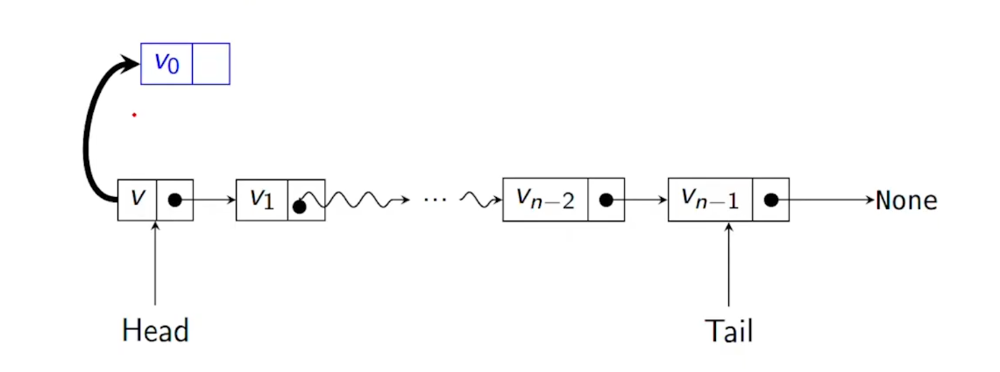

# LISTS
***
list and arrays are two basic ways of storing sequence of values

## Lists
* flexible length
* easy to modify its structure
* scattered in the memory
* lists are sequence of nodes
* each node contains a value and points to next node in the sequence
* "Linked" list:

* we know where the list begins(head) and the head gives us the information about next element(.)
* we can know about the tail if we want

* here v-1 points to v
* to insert x between them v-1 points to x and x points to v

* to delete:

* to delete v, v-1 is made to point to v+1
* and python will delete v automatically

* but the drawback is it needs to follow links to access L[i] and it takes time of O(i)
* for exchange also the worst case is O(n)
##### modifing a list:
* we will use python class Node
* a list is a sequence of nodes
    * self.value stores the value
    * self.next points to next node
    * if both the self.value and self.next are none then its the first element of the list 
``` python
class Node:
    def __init__(self, v = None):
        self.value = v
        self.next = None 
        return

    def isempty(self):
        if self.value = None
            return True
        else:
            return False
```
* let l1 = Node()
* let l2 = Node(5) # singleton set 5
* l1.isempty = True
* l2.isempty = False
##### Appending to a list 
* lets append v to the end of l
* if l is empty, update l.value to v
* if we are at the last value then l.next is none
* if at anywhere between then we try to append to the next untill the last element comes
``` python
def append(self,v):
    if self.isempty():
        self.value = v # if the list is empty 
    elif self.next == None:
        self.next = Node(v) # if at last element 
    else:
        self.next.append(v) # if at any in between element 
```
method 2:
``` python
def append(self, v):
    if self.isempty():
        self.value = v
    temp = self 
    while temp != None:
        temp = temp.next
    temp.next = Node(v)
    return
```
##### to insert at the first of the list
* to insert v at the head we cannot change where the head points

* so we exchange the values of v and v<sub>0</sub>
* make a new node point to head.next
* and make head.next point to new node


##### code for insert 
```python
def insert(self, v):
    if self.isempty():
        self.value = v
        return
    new_node = Node(v)

    # here self is the head element and we change its value with the one we want to insert
    (self.value, new_node.value) = (new_node.value, self.value) 

    # then we switch links
    # we make the head point to the new_node and the new_node is pointing to the element pointed by the head(ie the second element before insert)
    (self.next, new_node.next) = (new_node, self.next)
    return 
```

##### delete a value:
* lets remove the first occurence of v in list l
* first scan for the element v and look ahead at next node
* if next node is v then bypass it
```python
def delete(self, v):
    if self.isempty():
        return
    if self.value == v:
        self.value = None
        if self.next != None:
            self.value = self.next.value
            self.next = self.next.next
        return
    else:
        if self.next != None:
            self.next.delete(v)
            if self.next.value = None
                self.value = None
```


