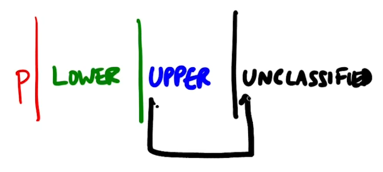

# ----- QUICK SORT -----
***
### Problem with merge sort:
Merge is fast but it is costly since it needs another list to store everything before merging,  so we use quick sort by sorting the halves before splitting
### Quick sort:
* let L be a list with median m.
* move all values <= m to the left and >m to the right
* recursively sort left and right halves
* now the list is sorted without  merge 
* recurrence T(n) = 2 T(n/2) + n
* T(n) is n log(n)
### Pivot:
* Now the problem is how do we find the median
* we cannot find median without sorting
*  so we pick some element 'PIVOT' and split L with respect to that element
* usually the first element is the  pivot element
### Partitioning
* we scan the list from left to right
* while scanning we divide the list into four 
	* P for Pivot 
	* Lower
	* Upper
	* Unclassified
* while examining the first unclassified element
	*  if it is larger than pivot extend it to Upper
	* if it is smaller than the pivot we need to append it to Lower
	* we do this by swapping the first element in Upper and the unclassified element
	* by doing this we don't need to use a second list
	
	