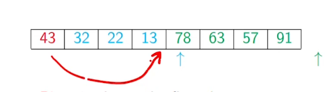
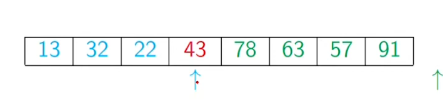

# ----- QUICK SORT -----
***
### Problem with merge sort:
Merge is fast but it is costly since it needs another list to store everything before merging,  so we use quick sort by sorting the halves before splitting
### Quick sort:
* let L be a list with median m.
* move all values <= m to the left and >m to the right
* recursively sort left and right halves
* now the list is sorted without  merge 
* recurrence T(n) = 2 T(n/2) + n
* T(n) is n log(n)
### Pivot:
* Now the problem is how do we find the median
* we cannot find median without sorting
*  so we pick some element 'PIVOT' and split L with respect to that element
* usually the first element is the  pivot element
### Partitioning
* we scan the list from left to right
* while scanning we divide the list into four 
	* P for Pivot 
	* Lower
	* Upper
	* Unclassified
* while examining the first unclassified element
	*if it is larger than pivot extend it to Upper
	* if it is smaller than the pivot we need to append it to Lower
	* we do this by swapping the first element in Upper and the unclassified element
	* by doing this we don't need to use a second list
	
    
* how it looks after partitioning:
    

* after partitioning we move pivot between upper and lower and sort lower and upper separately

    

### Quick sort code

```python
def quicksort(L, l, r): # sorts L from l to r
    if r - l <=1:
        return L
    
    (pivot, first_upper, last_upper) = (L[l], l+1, l+1)
    
    for i in range(l+1, r):
        
        if L[i] > pivot:
            last_upper += 1 # shiht the upper segment
        
        else:
            (L[i], L[first_upper]) = (L[first_upper], L[i]) # swap first_upper with L[i]
            (first_upper, last_upper) = (first_upper+1, last_upper+1) # shift both segments        
    
    # now lets move the pivot between lower and upper segement
    last_lower = first_upper - 1
    (L[l], L[last_lower]) = (L[last_lower], L[l])

    # now sort the lower and upper segments separately
    quicksort(L, l, last_lower)
    quicksort(L, last_lower + 1, last_upper)
    
    return L
```

### Analysis

* If pivot is median, T(n) is O(log n)
* But for the worst case, partitions are of size 1, n-1
    * T(n) = T(n-1) + n
    * T(n) = T(n-2) + n-1 + n
    * T(n) = 1 + 2 + ... + (n-2) + (n-1) + n
    * T(n) is O(n<sup>2</sup>)
* the worst case here is a sorted list
* however the average case is n logn
* Instead of fixed pivot(we took first element in our example) we take a random number between 0 and n-1 and again T(n) is n log n

* Even though the worst case is high quicksort is an effective algorithm and is used in many built in functions like sort in programming and in spread sheets

### Stable sorting
* often we dont sort just elements we mostly sort tables or tuples
* for example let a students table is sorted by roll no and now we have to sort it by name
* while sorting the roll no students of same name should not be mixed and this is crucial while sorting

* quicksort is not stable since it swaps values while partitioning
* but we merge carefully we can use merge sort as stable sorting
    * do not allow elements from the right to overtake elements on the left
    * while merging prefer the elements on the left in case of ties

* minimizing data movement
    * Imagine each element as a heavy carton
    * Reduce the effort of moving values around

### Best sorting algorithm

* quicksort is often the algorithm of choice despite its worst case
* merge sort is typically used in external sorting
    * database tables that are too large to store in memory at once
    * retrieve in parts from the disk and write back
* other n log n algorithms like heap sort
* Hybrid sort:
    * use divide and conquer for large n (quicksort or merge sort or any other)
    * and switch to insertion sort when n becomes smaller (n < 16 or 32)
