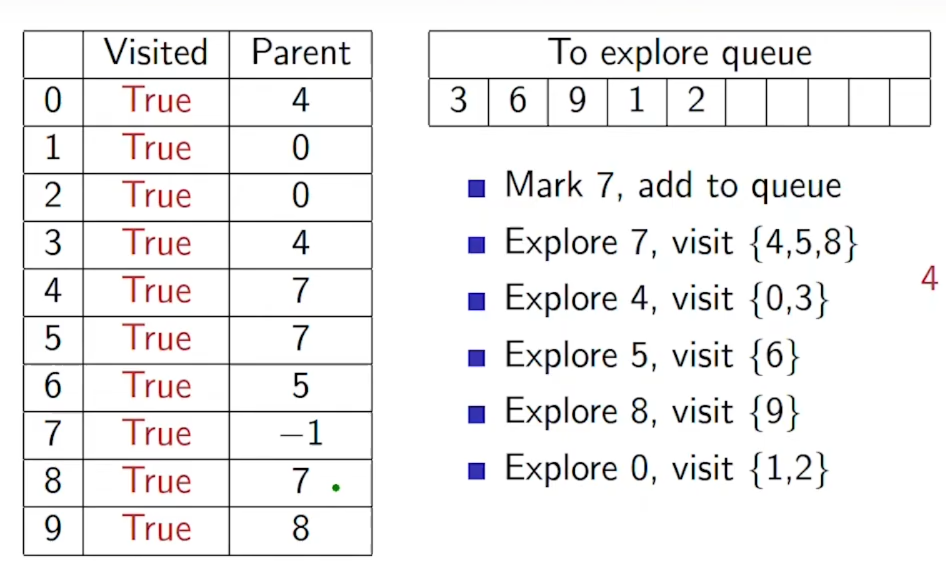

# BREADTH FIRST SEARCH
***

Explore the graph level by level
* first visit vertices of depth 1
* then 2 steps deep and so on

Each visited vertex has to be explored
* Extend the search to its neighbours
* Do this to each vertex one time only

Maintain information about vertices
* which vertices are visited
* which vertices are explored

Assume V = {0, 1, 2, ..., n-1}
* visited: V --> {True, False} tells us whether v in V has been visited or not
* Initially visited(v) = False for all v in V

Maintain a sequence of visited vertices yet to be explored
* lets use a queue and it will be initially empty
### Using a Queue:
```python
class Queue:
    def __init__(self):
        self.queue = []

    def isempty(self):
        return self.queue == []

    def addq(self, v):
        self.queue.append(v):

    def delq(self):
        v = None
        if not self.isempty():
            v = self.queue[0]

        self.queue = self.queue[1:]

        return (v)
    def __str__(self):
        return (str(self.queue))

q = Queue()

for i in range(3):
    q.addq(i)
    print(q)

print q.isempty()

for i in range(3):
    print(q.delq(), q)

print q.isempty()
```
First add i to the queue

Then we remove and explore i (which is the starting point). If i not what we needed then
* for each edge(i, j), if visited(j) is False, set it to True
* add j to queue

Repeat the process
* stop when the queue is empty
### BFS code
```python

def BFS(AMat, v):
    (rows, columns) = AMat.shape
    visited = {}

    for i in range(rows):
        visited[i] = False # setting visited false for all vertices

    q = Queue()

    visited[v] = True # setting visited True for the first vertex
    q.addq(v)

    while q.isempty():
        j = q.delq()

        for k in neighbours(Amat, j):
            if not visited[k]:
                visited[k] = True
                q.addq(k)
    return visited
```

### Complexity of BFS:

G = (V, E)

|V| = n

|E| = m

if G is connected(a garaph where every vertex is connected to every other vertex by a path) then m vary from n-1 to n(n-a)/2

#### visiting a vertex
in BFS each reachable vertex is processed exactly once
* visit a vertex and add it to queue
* explore the vertex and remove from queue
* so we visit and explore atmost n vertices

#### Exploring a vertex:
while using adjacency matrix
* to explore i we scan neighbbours(i)
* to scan neighbours(i), we need to check all n vertices
If we use adjacency list
* neighbours(i) is already available
* time to explore i is degree(i) (degree is the number of edges incident on vertex i)
* degree varies across vertices
* but sum of degrees is always 2m (2 times the no of edges since each edge is incident on two vertices

#### Time Complexity:
Adjacency Matrix:
* n steps to initialize each vertex
* n steps to explore each vertex
* Overall time O(n<sub></sub>)
Adjacenct List:
* n steps to initialize each vertex
* 2m steps to explore all vertices
* Overall time O(n+m)

For graphs O(m+n) is the best complexity since we look at each vertex and each edge once so it gives lineat time

### Enhancing BFS to record paths:
* in BFS if we set visited(k) to True, we set it to True while exploring some vertex j
* so we can say that j is the parent of k
* lets track parent(k) = j

```python

def BFSListPath(AList, v): # we use adjacency list instead of adjacency matrix
    visited = {}
    parent = {}

    for i in Alist.keys():
        visited[i] = False # setting visited false for all vertices
        parent[i] = -1 # since vertices range from 0 to n-1 no vertex will have a value of -1

    q = Queue()

    visited[v] = True # setting visited True for the first vertex
    q.addq(v)
    # we keep parent of the vertex to -1 to know where we started

    while q.isempty():
        j = q.delq()

        for k in Alist[j]:
            if not visited[k]:
                visited[k] = True
                parent[j] = j # since we visited k by following j we set j to be the parent of k
                q.addq(k)

    return visited, parent
```



here we can see that the starting vertex is 7 since its parent is -1

to find the path of vertex 1 to vertex 7 we start at 1 and see its parent and go from there

1 --> 0 --> 4 --> 7

like this we can find path of ant vertex

### Enhacing BFS to record distance:
* to record the distance from starting vertex to any vertex in the graph we record the level at which the vertex is visited
* instead of visited(k), we record level(k)
* instead of boolean we use integers to record distance

```python

def BFSListDistance(AList, v): # we use adjacency list instead of adjacency matrix
    level = {}
    parent = {}


    for i in Alist.keys():
        level[i] = -1 # since distance cannot be negative
        parent[i] = -1 # since vertices range from 0 to n-1 no vertex will have a value of -1

    q = Queue()

    level[v] = 0 # since we start here distance is 0
    q.addq(v)

    while q.isempty():
        j = q.delq()

        for k in Alist[j]:
            if level[k] == -1: # instead of visited use level to check if a vertex is visited
                level[k] = level[j] + 1
                parent[j] = j # since we visited k by following j we set j to be the parent of k
                q.addq(k)

    return level, parent
```

the level is the shortest distance between two vertices


