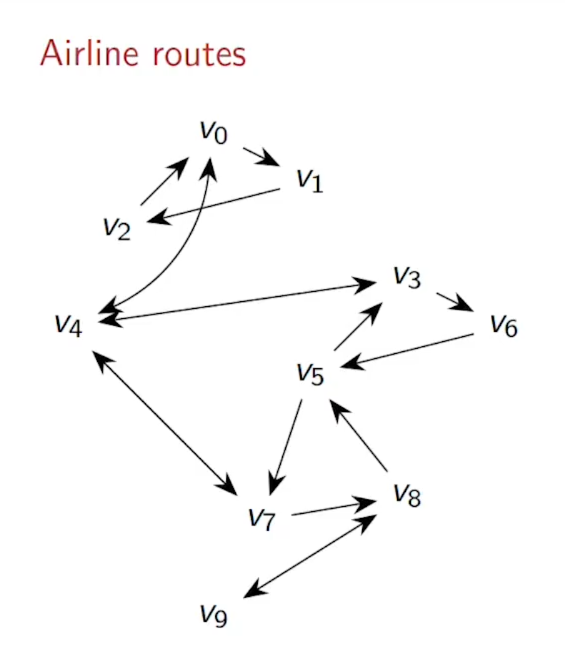
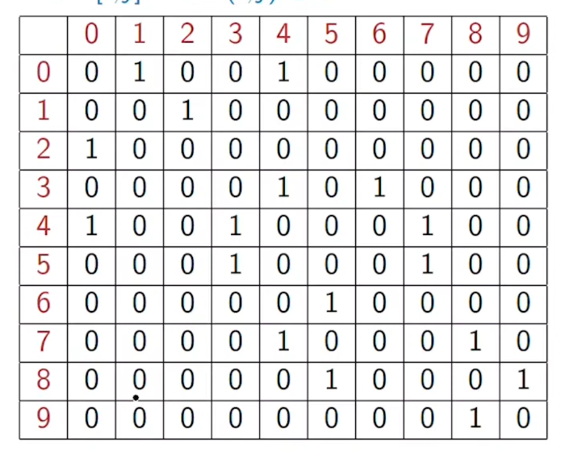
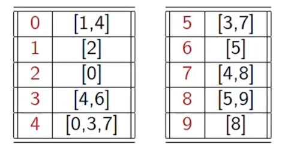
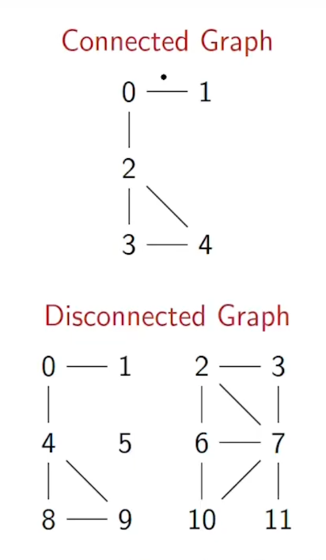

# GRAPHS
***

* graph G = (V, E) where V is the set of vertices and E is the edges
* a path is a sequence of vertices (v<sub>1</sub>, v<sub>2</sub>, v<sub>3</sub>, ...,v<sub>k</sub>)
* vertex v is reachable from vertex u if there is a path from u to v



* here we can see that in G we can reach v<sub>9</sub> from v<sub>0</sub>

### Adjacency Matrix
* let |V| = n when V = {0, 1, 2, ..., n-1}
* edges are now pairs (i, j) where 0 < i, j < n
    * usually assume i != j  so there is no self loops
* rows and columns numbers {0, 1, 2, ..., n-1}
* A[i, j] = 1 if i, j belongs to E

```python
# for the airlines graph
edges = [(0, 1), (0, 4),
         (1, 2), (2, 0),
         (3, 4), (3, 6),
         (4, 0), (4, 3), (4, 7),
         (5, 3), (5, 7),
         (6, 5),
         (7, 4), (7, 8),
         (8, 5), (8, 9),
         (9, 8)]

import numpy as np

A = np.zeroes(shape=(10, 10))

for (i, j) in edges:
    A[i, j] = 1

```

The result of this code is as follows



* to find the neighbours of i we scan the row i whose value is 1
* neighbours of 6 are 3 and 5

#### For directed graphs
* rows represrnt outgoing edges
* columns represent incoming edges

#### Degree of a vertex
* Number of vertices incident on a vertex i
* the degree of 6 is 2

* for directed graphs out degree and in degree

To find reachability of two vertices lets say to find reachability of v1 and v9, we start with v9 and mark all its neighbours which is 8. Then we mark the neighbours of 8 which are 5, 7, 9. We skip 9 since we started there. then we mark the neighbours of 5 and 7 and we do this until we reach our desired output

But we need some strategy to systematically explore markes neighbours

we use two primary strategies
* Breadth first search (propogate marks in layers)
* Depth first search (explore a path till it dies and backtrack)

### Adjacency list

In an adjacency matrix, the size is n<sup>2</sup> regardless of no of edges
* but for undirected graphs |E| <= n(n-1)/2
* for undirected graphs |E| <= n(n-1)
* typically |E| is much lower than n<sup>2</sup>

so we use adjacency lists which represents all the neighbours for each vertex in a list

```python

def neighbours(AMat, i):

    nbrs = []

    (rows, cols) = AMat.shape

    for j in range(cols):

        if AMat[i,j] == 1:

            nbrs.append(j)

    return(nbrs)

#print(neighbours(A,7))
```



the best way to represent it in python is through dictionaries

```python
AList = {}

for i in range(10) # since there are 10 vertices in G
    AList[i] = []

for (i, j) in edges:
    AList[i].append(j)

print(AList)

# output = {0: [1, 4], 1: [2], 2: [0], 3: [4, 6], 4: [0, 3, 7], 5: [3, 7], 6: [5], 7: [4, 8], 8: [5, 9], 9: [8]}

```

### connected graphs:
* A graph is connected if every vertex is reachable from each and every other vertex



* a disconnected graph consists of connects components
    * in the above example 1 - 0 - 4 - 8 - 9 is a connected component and 2 - 3 - 6 - 10 - 11 is a connects component
    * in disconnected graphs no of connected components is more than one

### cyclic graphs:
* a cycle is a path that starts and ends in the same vertex
    * 4 - 8 - 9 is a cycle
* cycles can repeat a vertex 2 - 3 - 7 - 10 - 6 - 7 - 2
* but edges should not be repeated 2 - 4 - 2
* simple cycle is a cycle when the only repeated vertices are the first vertex 4 - 8 - 9
* A graph is acyclic if there is no cycle

### **D**irected **A**cyclic **G**raphs(DAGs):
* G(V, E) is a DAG if it is a direcred graph with no directed cycles 
* most real world problems can be put in DAGs
