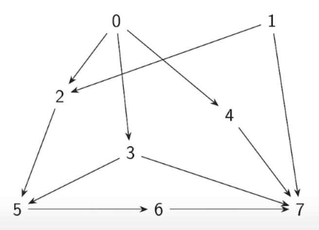

# TOPOLOGICAL SORTING

* for V = {0, 1, 2, ..., n-1}, for any (i, j) in E, i appears before j

* A graph with directed cycles cannot be sorted topologically
* every [[graphs#**D**irected **A**cyclic **G**raphs(DAGs):|DAG]] can be sorted topologically

### Algorithm:
* to be topologically sorted there has to be a vertex with no dependencies
* a vertex with no dependencies has no incoming edges ie, indegree(v) = 0
* every DAG has a vertex with indegree 0

* start with a vertex whose indegree > 0
* follow edges back to one of its predecessors
* repeat so long as indegree > 0
* in we repeat n times then that is a cycle which is impossible in a DAG

* take a vertex j out with indgree 0
* delete j and its edges
* what we remain with is another DAG
* now find another vertex with indegree 0 and remove its edges
* repeat till all vertices are took out
repeat till all vertices are took out

### Topological sort
* compute indegree of all vertices
* list a vertex with indegree 0 and delete it
* update indegrees 
* find another vertex with indegree 0 and eliminate it and update indegrees
* repeat until all vertices are listed

```python
def topologicalSort(AMat):
    (rows, cols) = AMat.shape
    indegree = {}
    topologically_sorted_list = []

    for col in cols:
        indegree[col] = 0
        for row in rows:
            if AMat[row, column] == 1:
                indegree[col] += 1

    for i in range(rows):
        j = min([k for k in range(cols) if indegree[k] = 0])

        topologically_sorted_list.append(j)
        indegree[j] -= 1

        for x in range(cols):
            if AMat[j, x] == 1:
                indegree[x] = indegree[x] - 1

    return topologically_sorted_list
```
