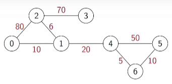
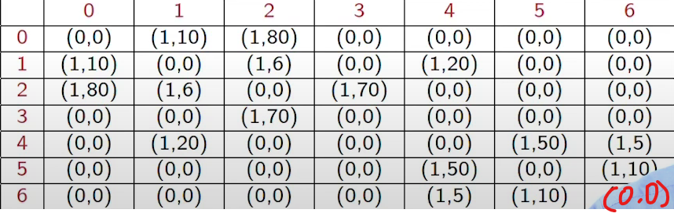
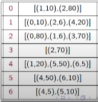
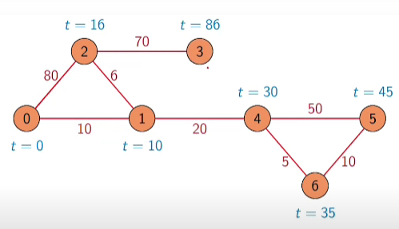
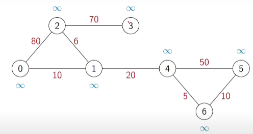
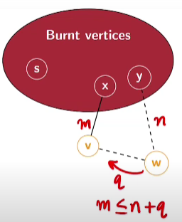

# Week 5

### SHORTEST PATH IN WEIGHTED GRAPHS

##### Weighted graphs
* BFS explores a graph level by level
* BFS compputes shortest path,in terms of number of edges, to every reachable vertex
* May assign values to edges
* Cost, time, distance,...
* Weighted graphs
* G = (V, E), W: E -> R

* Adjacency matrix: Record the weights along with edge information - weight is always 0 if no edge

* Adjacency list: Record weights along with the edge information

##### Shortest paths in weighted graphs

* BFS computes shortest path, in terms of number of edges, to every reachable vertex
* In a weighted graph, add up the weights along a path -Weighted shortest path need not have minimum number of edges
    * Shortest path from 0 to 2 is via 1 (weight = 16)

##### Shortest path problems
Single source shortest paths

* Find shortest paths from a fixed vertex to every other vertex
* Transport finished product from factory (single source) to all retail outlets
* Courier company delivers items from distribution centre (single source) to addresses

All pairs shortest path

* Find shortest paths between every pair of vertices i and f
* Optimal airline, railway, road routes between cities

##### Negative edges weights

* Can negative edge weights be meaningful?
* Taxi driver trying to head home at the end of the day
    * Roads with few customer, drive empty (positive weight)
    * Roads with many customers, make profit (negative weight)
    * Find route towards home that minimizes cost

##### Negative cycles

* A negative cycle is one whose weight is negative
    * Sum of the weights of edges that make up the cycle
* By repeatedly traversing a negative cycle, total cost keeps decreasing
* If a graph has a negative cycle, total cost keeps decreasing
* Without negative cycles, we can compute shortest paths even if some weights are negative

### Summary

* In a weighted graph, each edge has a cost
    * Entries in adjacency matrix capture edge weights
* Length of a path is the sum of the weights
    * Shortest path in a weighted graph need not be minimum in terms of number of edges
* Different shortest path problems
    * Single source - from one designated vertex to all others
    * All-pairs - Between every pair of vertices
* Negative edge weights
    * Should not have negative cycles
    * Without negative cycles, shortest paths still well defined

